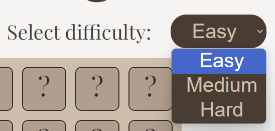
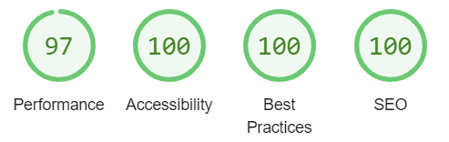

# Matching Bears

Matching Bears is a game website.

This website is designed for the user to play a matching pairs game.

Visit the deployed site here: [Matching Bears](https://gkicks.github.io/chuckles-comedy-club/)

# Contents

- [Matching Bears](#matching-bears)
- [Contents](#contents)
- [User Experience (UX)](#user-experience-ux)
  - [Initial Discussion](#initial-discussion)
    - [Key Information for the Site](#key-information-for-the-site)
  - [User Stories](#user-stories)
    - [Client Goals](#client-goals)
    - [Visitor Goals](#visitor-goals)
- [Design](#design)
  - [Colour Scheme](#colour-scheme)
  - [Typography](#typography)
  - [Imagery](#imagery)
    - [Favicon](#favicon)
    - [Card Images](#card-images)
  - [Wireframes](#wireframes)
    - [Desktop](#desktop)
      - [Start Page](#start-page)
      - [Main Page](#main-page-one)
      - [End Page](#end-page-one)
- [Features](#features)
  - [Existing Features](#existing-features)
    - [The Landing Page](#the-landing-page)
    - [The Main Page](#main-page-two)
    - [The End Page](#end-page-two)
    - [404.html](#404html)
  - [Future Implementations](#future-implementations)
  - [Accessibility](#accessibility)
    - [Wave Validator](#wave-validator)
- [Technologies Used](#technologies-used)
  - [Languages Used](#languages-used)
  - [Frameworks, libraries and programs used](#frameworks-libraries-and-programs-used)
- [Deployment and Local Development](#deployment-and-local-development)
  - [Deployment](#deployment)
  - [Local Development](#local-development)
    - [How to Fork](#how-to-fork)
    - [How to Clone](#how-to-clone)
- [Testing](#testing)
  - [Automated Testing](#automated-testing)
  - [WC3 Validator](#wc3-validator)
  - [JShint Validator](jshint-validator)
  - [Lighthouse](#lighthouse)
    - [Index.html](#indexhtml-1)
      - [Desktop](#desktop-1)
      - [Mobile](#mobile-1)
    - [404.html](#404html-1)
      - [Desktop](#desktop-5)
      - [Mobile](#mobile-5)
  - [Testing User Stories](#testing-user-stories)
    - [Client Goals](#client-goals-1)
    - [Visitor Goals](#visitor-goals-1)
  - [Full Testing](#full-testing)
    - [Start Page](#start-page-two)
    - [Main Page](#main-page-three)
    - [End Page](#end-page-three)
    - [404 Page](#404-page)
  - [Bugs](#bugs)
    - [Resolved Bugs](#resolved-bugs)
    - [Unresolved Bugs](#unresolved-bugs)
- [Credits](#credits)
  - [Code Used](#code-used)
  - [Content](#content)
  - [Media](#media)
  - [Other](#other)
  - [Acknowledgements](#acknowledgements)

[Back to top](#matching-bears)

# User Experience (UX)

## Initial Discussion

Matching Bears is a game playing website. The name Matching Bears is a wordplay on the well known game Matching Pairs. The website is user-friendly and easy to navigate, giving the user a smooth game playing experience

### Key Information for the Site

- How to play instructions
- Game playing area
- Statistics about the user’s game – time taken and number of flips

## User Stories

### Client Goals

- To be responsive on a range of devices
- The game to have different difficulty levels
- Statistics of the game to be displayed
- Have a link to a bears charity

### Visitor Goals

- To be able to easily navigate the website
- Understand the features of the website
- To have an enjoyable game playing experience
- To have the option of sound during the game but to be able to mute this
- To be rewarded when they have won the game
- To be able to play the game at different difficulty levels
- To be able to see their game playing statistics
- To have the opportunity to donate to a charity relating to bears

[Back to top](#matching-bears)

# Design

## Colour Scheme

- Five colours have been used throughout the website - #F6F4F3, #D5BDA9, #BA9D8C, #4C3B32 and #312C2D
- The brown colours were taken from a colour pallette, from the website Coolors, and were chosen as the brown reflects the bear theme

- I wanted the white to be an off white, to make the website easier on the eye, so used the #F6F4F3 colour I used in my last project. This colour compliments the brown pallette chosen

## Typography

- I used Fontjoy, a font pairing website, to help me make font choices. I selected Laila and Playfair Display as I felt that these reflected the game.

- To give the audio button a picture of a speaker I took icons from the website https://fontawesome.com/icons

## Imagery

### Favicon

- • I used a picture of a bear for my favicon. I chose this image as it’s a simple but very classic bear face. This image was taken from pixabay.com

### Card Images

- These images were all found on the website pixabay.com. There are eight different images, for the sixteen game cards, as there is a pair of each

| Card Description |                     Card Image                     |
| :--------------: | :------------------------------------------------: |
|   Yellow Bear    |      |
|  Confused Bear   |  |
|    Blue Bear     |          |
|    Brown Bear    |        |
|    Scary Bear    |        |
|    Panda Bear    |        |
|    Mouse Bear    |        |
|    Koala Bear    |        |

## Wireframes

- Wireframes were created using figma.com
- The website was designed to be the same across desktop and mobile

### Start Page

### Main Page

### End Page

View desktop wireframes on the Figma site: [Desktop](https://www.figma.com/file/4lZLQQasf5A6YJlC5U2uab/Matching-Bears?type=design&node-id=0%3A1&mode=design&t=1eOShOXN4bQ49Ew7-1)

[Back to top](#matching-bears)

# Features

## Existing Features

### The Landing Page

- The landing page is the page the user lands on when the website is first loaded
- There is a ‘How to Play’ area which the user can click on. This expands to give the user instructions on how to play

- The user must enter their name into the ‘enter name’ input before they can proceed to playing the game

- The ‘How to Play’ and ‘Start’ button both have styling so that the colour changes when the user hovers. The colours used are the inverse of the original to keep the colour theme consistent

### The Main Page

- The main page is the part of the website where the user will play Matching Bears

#### Audio Button

- There is an audio button so the user can choose whether to have sound on or not. The default is for the sound to be on. The user can click on this button to toggle between sound on and off

#### Select Difficulty

- There is an option for the user to select the difficulty, from the values ‘easy’, ‘medium’ and ‘hard’. This will change the amount of time the user has to complete the game. If the ‘easy’ option is selected the user will have 100 seconds, for ‘medium’ they will have 60 seconds and for ‘hard’ they will have 30 seconds
- The default difficulty level is ‘easy’
- The styling for the select changes the colour of it on hover. The styling used is the inverse of the original. This is the same as the hover styling of the buttons to keep the website consistent

- When the user has clicked a card the select difficulty option is disabled. This is to prevent the user changing this mid game and giving themselves more time

#### The game container

- This is the focus of the website. There are 16 cards that are randomly generated when the user starts the game

- When the user clicks a card the card will flip. There is an animation to make this resemble a physical card being turned
- When the user clicks the card, if the audio button is not on mute, a card flipping sound will play
- Once a card has been flipped it cannot be flipped back over by the user. This enables the game play to work correctly
- If the user flips two cards, and they are not a match, they will flip back over
- Game play is disabled at this point until the two cards have been flipped back. This prevents the user clicking all the cards quickly so game play can proceed in the correct way
- If the user flips two cards and they do match a match sound will play and these two cards will remain facing upwards

- When all the cards have been matched there is an animation where the cards wiggle from side to side. This is a visual reward to the user for winning the game

#### Time

- The time display counts down, in seconds, as the user plays the game.
- The timer doesn’t start until the user has clicked the first card

#### Restart Button

- This gives the user the option to restart the game at any time.

- This is styled, on hover, as the other buttons are

- When the user clicks this, a confirm alert will be displayed. This is to prevent the user clicking this in error
- The user will click ‘yes’ if they meant to restart and ‘cancel’ if restart was pressed in error

- When the restart button is pressed;
  - The cards will be reshuffled
  - The difficulty selector will no longer be disabled so the user can change the difficulty level – this will default to the difficulty level the user was last playing at. This will be disabled again as soon as the user clicks a card
  - The time count will reset to that of the difficulty level selected. This will not start counting down until the user clicks a card
  - The flips count will reset to zero

#### Flip Count

- The flip count tells the user how many cards they have flipped.
- This increases, by one, each time a card is flipped

### End Page

- If the user is able to match all the cards, in the time allowed, a winning message will appear over the main page.
- This will pull the name of the player, which they inputted at the start of the game, the time the player had remining and the number of flips they were able to win the game in

- If the player runs out of time a losing message will appear. This will also pull the name of the user from the input entry

- The end message fades in to make the transition less jarring and to create a more pleasant user experience
- There is an option for the user to restart the game. This has the same hover styling as the other button elements. The restart button will hide the end game message and take the player back to the main screen where the game will be reset in the same way as the restart button does on the main page

- There is no confirm alert on the restart button on the end page as restarting is the only option to continue the game at this point
- Beneath the restart game option there is a link the user can click. This will take them to the Animal Asia charity website where, if they wish, they can make a donation to help the bears

- The link scales, by 1.2, on hover, to entice the user to click it

### 404.html

- I added a custom 404.html page. This will be displayed if a user makes a typing error when entering the url of the website

- There is a 'Return to Home' button so the user can easily navigate back the Home page

## Future Implementations

- The user to be able to choose a range of game area sizes, with more of less cards. This could either have more / less pairs or more than two of the same image
- For the user to be able to choose from different sets of images
- There to be a leaderboard of scores. This could be on a local level, and based from the users statistics, or could be a leaderboard from all players playing the game
- Other games to be added

## Accessibility

- All pages use semantic html
- Aria-labels were used to improve accessibility for those using assistive technology. These are in all links apart from those in the footer. This is due to the footer text already telling those using a screen reader where the link would take them
- I used the Google Chrome extensions:
    - Web Disability Simulator – simulated the website for people with sight, mobility, reading and writing and concentration disabilities to view the webpage how others could see it. There were no concerns noted in these simulations

### Wave Validator

I used the Wave validator to check if I could improve the user experience of the webpage for those with disabilities. This flagged no errors

- There were two alerts. The first alert was for a possible heading. This was for the ‘enter your name and press start to begin paragraph. I left this as a paragraph as, it is not a header, and is not necessary to have it as a header for accessibility – I checked this with a screen reader and the enter name input makes it clear what needs to be entered here
- The second alert was because of the noscript tag in the html. I did some research and there were many sources that said, when the noscript element is written as mine is written, it is perfectly accessible. I decided to keep this in as it may be needed by someone who is using a browser that doesn’t support JavaScript

- No contrast errors were found

[Back to top](#matching-bears)

# Technologies Used

## Languages Used

HTML, CSS and JavaScript were used to create this website. 

## Frameworks, libraries and programs used

- Am I Responsive? To show the website image on a range of devices
- Codeanywhere – To write the code
- Convertio - To change images to webp format and reduce file size
- Figma – To create wireframes
- Font Awesome - For the iconography on the social media links
- Github - To save and store files 
- Google Dev Tools – Used to troubleshoot and debug
- Google Fonts - To import the fonts used on the website
- JShint – to check for any issues in the JavaScript code
- Wave Validator – To check if improvement could be made for those users with disabilities
- WC3 Validator / Jigsaw – To check code meets the required standard 

[Back to top](#matching-bears)

# Deployment and Local Development

## Deployment

This site is deployed using Github pages:

* *Sign up and login to GitHub
* Find the GitHub repository <https://github.com/Gkicks/matching-bears.git>
* Click “settings”
* In the lefthand navigation panel locate and click “pages”
* Change the branch from “none” to “main”
* Click “save”
* The website will then be deployed. This process my take a few minutes and then “your site is live at …” will appear towards the top of the page

## Local Development

### How to Fork

* Sign up and login to GitHub
* Find the GitHub repository <https://github.com/Gkicks/matching-bears.git>
* Locate the “fork” button which is located towards the top of the page. Click this button

### How to Clone

* Sign up and login to GitHub
* Find the GitHub repository <https://github.com/Gkicks/matching-bears.git>
* Locate the “<> Code” button and click this. This will bring up a new panel
* Click the local tab
* Decide if you would like to clone with HTTPS, SSH or GitHub CLI – copy the link shown under the one of your choosing
* Open your code editor
* Open a new terminal in your code editor and change the working directory to the location you want to use for the clone directory (you can use the cd command to change directories)
* When you are in your chosen directory type “git clone” followed by pasting in the URL you copied in GitHub
* Press enter to execute the command and your clone will be created

[Back to top](#matching-bears)

# Testing

## Automated Testing 

I tested the website in the following browsers:

- Chrome
- Edge
- Firefox

There were two concerns noted from testing in Firefox:

- When the user clicked into the input the border was blue. I added input:-moz-focusring into css and that the outline be outline: 1px solid #4D3B32;
- The ? text, on the card back was still showing when the card was flipped. I added an animation, to the toggleCard class, to make the opacity of the text change to 0 while the toggleClass class was present

I also used Chrome Developer tools to look for bugs throughout designing and building the website and test how the screen looked and worked on the following device screens:

- iPhone SE
- iPhone XR
- iPhone 12 Pro
- Pixel 5
- Samsung Galaxy S8+
- Galaxy S20 Ultra
- iPad Air
- iPad Mini
- Surface Pro 7
- Surface Duo
- Galaxy Fold
- Samsung Galaxy A51/71
- Nest Hub
- Nest Hub Max
- iPhone 6/7/8
- Facebook for Android v407 on Pixel 6
Of these, the narrowest screensize was the Galaxy Fold so I made sure the website was responsive down to this size. I have a Galaxy Fold 4 so also tested the website on this device.

I asked friends and family to test the website on their devices. There was one concern raised from this:

- On a IPhone 8 only the bottom third of the screen was showing. I had also found a bug with the webpage not being displayed, at the top of the page, on reload, and I suspected this was the same issue. I resolved this by:

    - Added  window.addEventListener('DOMContentLoaded', function () {
    window.scrollTo(0, 0);
    title.scrollIntoView();
});
to script.js
    - Removed align-items: centre from the body element
    - Changed overflow: hidden to overflow-x: hidden on the body element

This resolved both issues

## WC3 Validator

I ran my HTML and CSS through the WC3 Validators. There were no errors returned through doing this in either the index.html nor 404.html pages. The validator showed this message for both:

I used the WC3 Jigsaw validator to test my CSS. This returned:
final

And JShint to check my Javascipt. This returned one concern:

However, through discussions with my mentor, Graeme, it was decided this was a warning, rather than an error and it didn’t affect my code negatively in any way. Graeme showed me how to configure JShint to remove the check for this incidence. JShint then showed no concerns:

## Lighthouse

I used Lighthouse, within the Chrome developer tools, to check the performance, accessibilty, SEO and best practice of the website

### Index.html

#### Desktop

#### Mobile

### 404.html

#### Desktop

#### Mobile

## Manual Testing

### Testing User Stories

### Client Goals

| Goal | How is this achieved? |
|:----:| :-------------------: |
| To be responsive on a range of devices | The website was tested on various sizes and was responsive to all sizes tested – see automated testing section |
| The game to have different difficulty levels | There are three difficulty levels the user can choose from. At the easy level they have 100 seconds to complete the game, at medium they have 60 seconds and, at hard, 30 seconds |
| Statistics of the game to be displayed | There is a countdown timer in the bottom lefthand corner of the screen which tells the user how much time they have left. In the right hand corner there is a flip counter which increases, by one, each time a card is flipped. The winning message tells the user how much time they have remaining and how many flips it took them to complete the game |
| Have a link to a bears charity | This is included in the end game div and contains an external link to a charity that helps bears that are farmed for their bile

### Visitor Goals

| Goal | How is this achieved? |
|:----:| :-------------------: |
| To be able to easily navigate the website | The website is intuative and easy to navigate. Any buttons are where the user would expect them to be and clearly visible |
| Understand the features of the website | The design has been kept simple, so it's clear the function of each part of the site. Buttons are designed to make the function very clear to the user |
| To have an enjoyable game playing experience | The site is simple to use and offers different difficulty levels, as well as game playing statistics, to enhance the user experience. All those I asked to test the game said they had enjoyed playing it |
| To have the option of sound during the game but to be able to mute this | The game has an audio button that’s located just under the main title. This can be toggled between audio and mute |
| Be rewarded when they have won the game | When all the cards have been matched there is an animation where the cards will wiggle briefly, because a congratulations message appears |
| To be able to play the game at different difficulty levels | There are three difficulty levels the user can choose from. At the easy level they have 100 seconds to complete the game, at medium they have 60 seconds and, at hard, 30 seconds |
| To be able to see their game playing statistics | There is a countdown timer in the bottom lefthand corner of the screen which tells the user how much time they have left. In the right hand corner there is a flip counter which increases, by one, each time a card is flipped. The winning message tells the user how much time they have remaining and how many flips it took them to complete the game | 
| To have the opportunity to donate to a charity relating to bears | This is included in the end game div and contains an external link to a charity that helps bears that are farmed for their bile |

## Full Testing

Full testing was completed on the following devices:
	
* Galaxy Fold 4 (mobile)
* Galaxy A20e (mobile)
* Galaxy Book2 Pro360 (15.6” laptop)
* Dell Computer (desktop)
* iPad 8th Generation (tablet)

### Start Page

| Feature |	Expected Outcome | Testing Performed | Result | Pass / Fail |
| :-----: | :--------------: | :---------------: | :----: | :---------: |
| How to Play Title | For the colours to be inverted on hover and for an instructions area to be displayed when clicked. The instructions to disappear when clicked again | Clicked on title | Colours inverted on hover. The instructions display was toggled with repeated clicks | Pass |
|Input fields | Allow user to enter their personal details | Entered details into each input | Information inputted | Pass |
| Start Game button | The display to move to the main page on click | Clicked on button | Game play area was displayed on click | Pass |
| Start Game button on hover | Colours to invert | Hovered over button | Colours inverted | Pass |

### Main Page

| Feature |	Expected Outcome | Testing Performed | Result | Pass / Fail |
| :-----: | :--------------: | :---------------: | :----: | :---------: |
| Audio Button | Display to toggle between volume icon and mute icon when clicked | Clicked on button | Diplay toggled between volume icon and mute icon | Pass |
| Audio Button with Volume Icon Showing | Flipping card sound to be played when the user flips a card and a ding sound to play when the user matches a card | Played game with audio button showing the volume icon | Flipping card sound played when a card flipped and a ding sound played when two cards were matched | Pass |
| Audio Button with Mute Icon Showing | No sound to be played throughout the game | Played game with audio button showing the mute icon | No sound was played throughout the game | Pass |
| Difficulty Selector | When clicked, a drop down box to appear that gives the user the option of easy, medium or hard | Clicked on Select | A dropdpwn box showed with three option to select from – easy, medium and hard | Pass |
| Difficulty Selector on hover |  Colours to be inverted | Hovered on Select | Colours inverted on hover | Pass |
| Difficulty Selector when card has been clicked to start game | Select to be disabled | Clicked on Card and then clicked Select | Select was faded out and I was unable to click it | Pass |
| Time Counter | To have a different starting number based on difficulty selected. For easy to display 100, for medium 60 and, for hard, 30 | Clicked on each Select option | The timer showed 100 when easy was selected, 60 when medium and 30 when hard | Pass |
| Time Counter during game play | To reduce by one each second from when the first card is clicked | Clicked on a card at each of the three difficulty levels. Timed the countdown, with a stopwatch, to check accuracy | The timer started, at each of the difficulty levels, when the first card was clicked. The countdown time matched that of my stopwatch | Pass |
| Time Counter reaching zero | End page to be displayed with a losing message | Waited for the time to reach zero | The end game page was displayed with a commiseration message | Pass |
| Time Counter on all card being matched | To stop counting down | Won the game | The timer stopped | Pass |
| Restart Button | A confirmation alert to appear, asking the user if they’re sure they want to restart the game
The game to be restarted:
- The difficulty selector to be enabled
- The time to reset to the difficulty and not count down until first card is clicked again
- Flips to be reset to zero
- Any cards that have been matched to be flipped back over
- Cards to be reshuffled 
 | Played the game for a while and then clicked the restart button | A confimation box appeared on click. I clicked ‘okay’.
I was able to change the difficulty, the time count reset to that determined by the difficulty level, the flip counts rest to zero, any cards that were facing up flipped back over. The cards were not the same as they previously were and had been reshuffled
 | Pass |
 | Restart button on hover | Colours to invert | Hovered over button | Colours inverted | Pass |
 | Flip Counter | To increase by one each time a card is clicked | Played the game. I tried clicking on different areas during play | There was a bug that, when two unmatched cards were turned, I was still able to clicked an unturned card and increased the flip counter. I fixed this (see bug section) and the flip counter only increases when a card flips | Pass |
 | Card | To flip over when clicked. To stay facing up until another card is flipped | Clicked card | Card flipped over and stayed facing up | Pass | 
 | Two unmatched cards flipped | To display both card faces before flipping back over. To not be able to flip any other cards until they have both flipped back | Clicked on two cards in an unmatched pair. Tried cllicking other cards while they were still facing up | The two unmatched cards were displayed before flipping back. While these two card were in play I was unable to flip an other cards | Pass |
 | Two matched cards flipped | For the two matching cards to remain facing upwards throughout the game | Played the game | Any two matched cards remaining facing upwards until the game ended | Pass |
 | All cards on all being matched | All cards to display a wiggle animation before a winning end page is displayed | Won the game | The cards wiggled before the winning game display was shown | Pass |

### End Page 

| Feature |	Expected Outcome | Testing Performed | Result | Pass / Fail |
| :-----: | :--------------: | :---------------: | :----: | :---------: |
| Winning Message | To use the name the user inputted at the start. To pull the time that was remaining and the number of flips the user had completed the game in | Won the game | The winning message was displayed. It showed my name, the time I had remianing and the number of flips I had taken to win | Pass |
| Losing Message | To use the name the user inputted at the start. | Lost the game | The losing message was displayed and it contained the name I had inputting at the beginning | Pass |
| Restart button | The end game message to disappear and the game playing area to be displayed
- The difficulty selector to be enabled
- The time to reset to the difficulty and not count down until first card is clicked again
- Flips to be reset to zero
- Any cards that have been matched to be flipped back over
- Cards to be reshuffled | Clicked the button | The end game message disappeared and the game playing area was displayed. 
I was able to change the difficulty, the time count reset to that determined by the difficulty level, the flip counts rest to zero, any cards that were facing up flipped back over. The cards were not the same as they previously were and had been reshuffled | Pass |
| Restart button on hover | Colours to invert | Hovered over button | Colours inverted | Pass |
| Help the Bears link | The user to be taken to the Animal Asia charity page in a new window | Clicked the link | Opened the correct website in a new browser page | Pass |
| Help the Bears link hover | Size to increase | Hovered over the link | Link size expanded | Pass |

### 404 Page

| Feature |	Expected Outcome | Testing Performed | Result | Pass / Fail |
| :-----: | :--------------: | :---------------: | :----: | :---------: |
| Return to Home button	| Links to the Home Page | Clicked button | Home Page opened | Pass |

## Bugs

### Resolved Bugs

### Unresolved Bugs

[Back to top](#matching-bears)

# Credits

## Code Used

- •	cardInfo.sort(() => Math.random() - 0.5);

This code was taken from the website https://www.slingacademy.com/article/ways-to-shuffle-an-array-in-javascript and was using in my generateCards function to shuffle the cards

## Content

All content was written by Gail Kicks

## Media

All photos and audio was taken from the websites pixabay.com

## Other

I used the following resources to expand my knowledge of JavaScript, html and css:

- The Code Institute lessons, including the LoveMaths project
- The Ultimate 2023 Fullstack Web Developer Bootcamp on Udemy
- developer.mozilla.org
- stackoverflow.com
- w3schools.com
- linuxhint.com
- foolishdeveloper.com
- Code Institute’s Slack community

## Acknowledgements

I would like to acknowledge the following people for their help in completing my project:

- My mentor, Graeme Taylor, for his advice and ideas
- My family and friends for helping me during the testing stages
- The Tutor Support team at Code Institute
- The Code Institute Slack community
- Kera Cudmore for her fantastic README presentation and documentation
- The Code Institute Assessment team for their thorough assessment of my first project. I used the comments given to improve on those areas in this project

[Back to top](#matching-bears)