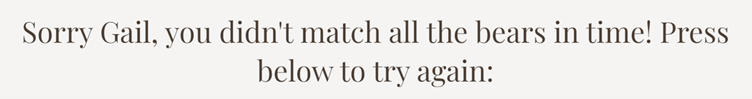

# Matching Bears

Matching Bears is a game website.

This website is designed for the user to play a matching pairs game.

Visit the deployed site here: [Matching Bears](https://gkicks.github.io/chuckles-comedy-club/)

# Contents

- [Matching Bears](#matching-bears)
- [Contents](#contents)
- [User Experience (UX)](#user-experience-ux)
  - [Initial Discussion](#initial-discussion)
    - [Key Information for the Site](#key-information-for-the-site)
  - [User Stories](#user-stories)
    - [Client Goals](#client-goals)
    - [Visitor Goals](#visitor-goals)
- [Design](#design)
  - [Colour Scheme](#colour-scheme)
  - [Typography](#typography)
  - [Imagery](#imagery)
    - [Favicon](#favicon)
    - [Card Images](#card-images)
  - [Wireframes](#wireframes)
    - [Desktop](#desktop)
      - [Start Page](#start-page)
      - [Main Page](#main-page-one)
      - [End Page](#end-page-one)
- [Features](#features)
  - [Existing Features](#existing-features)
    - [The Landing Page](#the-landing-page)
    - [The Main Page](#main-page-two)
    - [The End Page](#end-page-two)
    - [404.html](#404html)
  - [Future Implementations](#future-implementations)
  - [Accessibility](#accessibility)
    - [Wave Validator](#wave-validator)
- [Technologies Used](#technologies-used)
  - [Languages Used](#languages-used)
  - [Frameworks, libraries and programs used](#frameworks-libraries-and-programs-used)
- [Deployment and Local Development](#deployment-and-local-development)
  - [Deployment](#deployment)
  - [Local Development](#local-development)
    - [How to Fork](#how-to-fork)
    - [How to Clone](#how-to-clone)
- [Testing](#testing)
  - [Automated Testing](#automated-testing)
  - [WC3 Validator](#wc3-validator)
  - [JShint Validator](jshint-validator)
  - [Lighthouse](#lighthouse)
    - [Index.html](#indexhtml-1)
      - [Desktop](#desktop-1)
      - [Mobile](#mobile-1)
    - [404.html](#404html-1)
      - [Desktop](#desktop-5)
      - [Mobile](#mobile-5)
  - [Testing User Stories](#testing-user-stories)
    - [Client Goals](#client-goals-1)
    - [Visitor Goals](#visitor-goals-1)
  - [Full Testing](#full-testing)
    - [Start Page](#start-page-two)
    - [Main Page](#main-page-three)
    - [End Page](#end-page-three)
    - [404 Page](#404-page)
  - [Bugs](#bugs)
    - [Resolved Bugs](#resolved-bugs)
    - [Unresolved Bugs](#unresolved-bugs)
- [Credits](#credits)
  - [Code Used](#code-used)
  - [Content](#content)
  - [Media](#media)
  - [Other](#other)
  - [Acknowledgements](#acknowledgements)

[Back to top](#matching-bears)

# User Experience (UX)

## Initial Discussion

Matching Bears is a game playing website. The name Matching Bears is a wordplay on the well known game Matching Pairs. The website is user-friendly and easy to navigate, giving the user a smooth game playing experience

### Key Information for the Site

- How to play instructions
- Game playing area
- Statistics about the user’s game – time taken and number of flips

## User Stories

### Client Goals

- To be responsive on a range of devices
- The game to have different difficulty levels
- Statistics of the game to be displayed
- Have a link to a bears charity

### Visitor Goals

- To be able to easily navigate the website
- Understand the features of the website
- To have an enjoyable game playing experience
- To have the option of sound during the game but to be able to mute this
- To be rewarded when they have won the game
- To be able to play the game at different difficulty levels
- To be able to see their game playing statistics
- To have the opportunity to donate to a charity relating to bears

[Back to top](#matching-bears)

# Design

## Colour Scheme

- Five colours have been used throughout the website - #F6F4F3, #D5BDA9, #BA9D8C, #4C3B32 and #312C2D
- The brown colours were taken from a colour pallette, from the website Coolors, and were chosen as the brown reflects the bear theme

- I wanted the white to be an off white, to make the website easier on the eye, so used the #F6F4F3 colour I used in my last project. This colour compliments the brown pallette chosen

## Typography

- I used Fontjoy, a font pairing website, to help me make font choices. I selected Laila and Playfair Display as I felt that these reflected the game.

- To give the audio button a picture of a speaker I took icons from the website https://fontawesome.com/icons

## Imagery

### Favicon

- • I used a picture of a bear for my favicon. I chose this image as it’s a simple but very classic bear face. This image was taken from pixabay.com

### Card Images

- These images were all found on the website pixabay.com. There are eight different images, for the sixteen game cards, as there is a pair of each

| Card Description |                     Card Image                     |
| :--------------: | :------------------------------------------------: |
|   Yellow Bear    |      |
|  Confused Bear   |  |
|    Blue Bear     |          |
|    Brown Bear    |        |
|    Scary Bear    |        |
|    Panda Bear    |        |
|    Mouse Bear    |        |
|    Koala Bear    |        |

## Wireframes

- Wireframes were created using figma.com
- The website was designed to be the same across desktop and mobile

### Start Page

### Main Page

### End Page

View desktop wireframes on the Figma site: [Desktop](https://www.figma.com/file/4lZLQQasf5A6YJlC5U2uab/Matching-Bears?type=design&node-id=0%3A1&mode=design&t=1eOShOXN4bQ49Ew7-1)

[Back to top](#matching-bears)

# Features

## Existing Features

### The Landing Page

- The landing page is the page the user lands on when the website is first loaded
- There is a ‘How to Play’ area which the user can click on. This expands to give the user instructions on how to play

- The user must enter their name into the ‘enter name’ input before they can proceed to playing the game

- The ‘How to Play’ and ‘Start’ button both have styling so that the colour changes when the user hovers. The colours used are the inverse of the original to keep the colour theme consistent

### The Main Page

- The main page is the part of the website where the user will play Matching Bears

#### Audio Button

- There is an audio button so the user can choose whether to have sound on or not. The default is for the sound to be on. The user can click on this button to toggle between sound on and off

#### Select Difficulty

- There is an option for the user to select the difficulty, from the values ‘easy’, ‘medium’ and ‘hard’. This will change the amount of time the user has to complete the game. If the ‘easy’ option is selected the user will have 100 seconds, for ‘medium’ they will have 60 seconds and for ‘hard’ they will have 30 seconds
- The default difficulty level is ‘easy’
- The styling for the select changes the colour of it on hover. The styling used is the inverse of the original. This is the same as the hover styling of the buttons to keep the website consistent

- When the user has clicked a card the select difficulty option is disabled. This is to prevent the user changing this mid game and giving themselves more time

#### The game container

- This is the focus of the website. There are 16 cards that are randomly generated when the user starts the game

- When the user clicks a card the card will flip. There is an animation to make this resemble a physical card being turned
- When the user clicks the card, if the audio button is not on mute, a card flipping sound will play
- Once a card has been flipped it cannot be flipped back over by the user. This enables the game play to work correctly
- If the user flips two cards, and they are not a match, they will flip back over
- Game play is disabled at this point until the two cards have been flipped back. This prevents the user clicking all the cards quickly so game play can proceed in the correct way
- If the user flips two cards and they do match a match sound will play and these two cards will remain facing upwards

- When all the cards have been matched there is an animation where the cards wiggle from side to side. This is a visual reward to the user for winning the game

#### Time

- The time display counts down, in seconds, as the user plays the game. 
- The timer doesn’t start until the user has clicked the first card

#### Restart Button

- This gives the user the option to restart the game at any time.

- This is styled, on hover, as the other buttons are

- When the user clicks this, a confirm alert will be displayed. This is to prevent the user clicking this in error
- The user will click ‘yes’ if they meant to restart and ‘cancel’ if restart was pressed in error

- When the restart button is pressed;
    - The cards will be reshuffled
    - The difficulty selector will no longer be disabled so the user can change the difficulty level – this will default to the difficulty level the user was last playing at. This will be disabled again as soon as the user clicks a card
    - The time count will reset to that of the difficulty level selected. This will not start counting down until the user clicks a card
    - The flips count will reset to zero

#### Flip Count  

- The flip count tells the user how many cards they have flipped.
- This increases, by one, each time a card is flipped

### End Page

- If the user is able to match all the cards, in the time allowed, a winning message will appear over the main page. 
- This will pull the name of the player, which they inputted at the start of the game, the time the player had remining and the number of flips they were able to win the game in

- If the player runs out of time a losing message will appear. This will also pull the name of the user from the input entry

- The end message fades in to make the transition less jarring and to create a more pleasant user experience
- There is an option for the user to restart the game. This has the same hover styling as the other button elements. The restart button will hide the end game message and take the player back to the main screen where the game will be reset in the same way as the restart button does on the main page

- There is no confirm alert on the restart button on the end page as restarting is the only option to continue the game at this point
- Beneath the restart game option there is a link the user can click. This will take them to the Animal Asia charity website where, if they wish, they can make a donation to help the bears

- The link scales, by 1.2, on hover, to entice the user to click it

### Footer

- The footer features on all three main pages of the website, as well as the thank you page, following the user completing the signup form
- The footer contain links to the social media sites Facebook, Twitter and Instagram. Chuckles Comedy Club currently doesn’t have social media pages but, once these are created, the links will link to these
- The styling of the footer reflects that of the header to simplify the user experience
- The footer does not contain aria-labels as the words already explain what the link is for

### Whats On

- The What’s On page shows the user the acts that will be performing the coming weekend
- There are three performers shown each night and each performer is shown with their name (fake names used), photo and a short audio clip of their stand-up routine

### Sign Up

- The Sign Up page allows users to sign up to receive emails and special offers for upcoming events
- The background image used is an American flag to symbolise the nationality of the comics performing
- There are three input fields for the user to enter their forename, surname and email address. These have aria-labels to improve accessibility for those users using assistive technology
- All three inputs require data to be entered before allowing the user to submit the form. The email input requires the data to be entered in the form of an email address
- There is also a select dropdown box that would be used to collect data, for the comedy club, to be able to pinpoint where to focus their marketing strategy

### Thank You

- The thank you page is displayed when the sign up form is submitted. This gives the user confirmation that their request has been received
- There is a 'Return to Home' button so the user can easily navigate back te Home page

### 404.html

- Following advice from my mentor I added a custom 404.html page. This will be displayed if a user makes a typing error when entering the url of the website

* There is a 'Return to Home' button so the user can easily navigate back the Home page

## Future Implications

- The functionality to be able to purchase tickets to performances, through the website
- More information about venue facilities – i.e., food and drink menus, disability access
- Search function to allow users to search the website
- A FAQ page to be added
- Transcripts to be added to the audio elements
- Functionality to be added for a non-technical administrator to be able to upload upcoming acts
- Social media sites to be developed for Chuckles Comedy Club

## Accessibility

- All pages use semantic html
- Aria-labels were used to improve accessibility for those using assistive technology. These are in all links apart from those in the footer. This is due to the footer text already telling those, using a screen reader, where the link would take them
- I used the Google Chrome extensions:
  - Web Disability Simulator – simulated the website for people with sight, mobility, reading and writing and concentration disabilities to view the webpage how others could see it. There were no concerns noted in these simulations
  - Screen Reader – Simulated how the website experience would be for a user using a screen reader. There were no concerns noted using this simulation
  - I used https://webaim.org/resources/contrastchecker/ to check the contrasts of the colours chosen. This passed for both combinations of red and white (contrast ratio 7
    .62:1) and blue and white (contrast ratio 12.82:1). This failed for the blue and red combination (contrast ratio 1.68:1) so this was not used in the website

### Wave Validator

I used the Wave validator to check if I could improve the user experience of the webpage for those with disabilities.

#### Home Page

When I first ran the validator there were two alerts but no errors:

- It detected that the tagline ‘bringing the best, of the US, to the UK!’ was in a paragraph element but looked like a header. I changed the paragraph element to an h2 which resolved this

- The second alert was that it was showing that the ‘Home’ nav link was redundant as there was an adjacent link to the same page. This is because the logo also links to the Home Page. I looked at the website https://www.nngroup.com/articles/homepage-links/ that detailed it was best practice for the logo to link to the Home Page, as that’s what user’s have come to expect. I decided to also leave the nav link to the Home Page in as I believe this will make the site easier to navigate, for the majority or users, while having minimal impact on those with disabilities. This alert was the same across all pages

#### What's On Page

There were seven alerts and no errors. One alert was due to the redundant home nav link, as above. The other six alerts were due to the audio not having a transcript. I tried to find a way to add a transcript to the audio but was unable to do this without ruining the look of the page. This would be an opportunity for further development

#### Sign Up Page

When I first ran the validator there were two alerts but no errors. The first alert was due to the redundant home nav link, as above. The second alert was because of an incorrect heading order. Wave showed that there was an h1 element, and two h3 elements, but no h2 element. This was resolved by changing the first h3 element (Sign up for our newsletter…) to an h2 element

#### Thank You Page

This showed one error that the page had a redirect and this can pose difficulties for screen reader users.

I chose to remove this functionality as there is a button for the user to return to the home page and, I don’t believe in inclusion of this function is justified, when it would negatively impact users with disabilities.

#### 404

This raised one alert that there was a possible header. I chose to leave this as a paragraph as I don’t believe this to be a header

[Back to top](#chuckles-comedy-club)

# Technologies Used

## Languages Used

HTML, CSS were mainly used to create this website. I used a small section of JavaScript code to resolve a bug in the audio

## Frameworks, libraries and programs used

- Am I Responsive? To show the website image on a range of devices
- Clideo - To convert audio clips to MP3
- Codeanywhere – To write the code
- Compress2go - To compress images to reduce file size
- Convertio - To change images to webp format
- Faviconcc - To create favicon
- Figma – To create wireframes
- Font Awesome - For the iconography on the social media links
- Github - To save and store files
- Google Dev Tools – Used to troubleshoot and debug
- Google Fonts - To import the fonts used on the website
- Spotify – The library my audio clips were taken from
- Wave Validator – To check if improvement could be made for those users with disabilities
- WC3 Validator / Jigsaw – To check code meets the required standard

[Back to top](#chuckles-comedy-club)

# Deployment and Local Development

## Deployment

This site is deployed using Github pages:

- \*Sign up and login to GitHub
- Find the GitHub repository <https://github.com/Gkicks/chuckles-comedy-club.git>
- Click “settings”
- In the lefthand navigation panel locate and click “pages”
- Change the branch from “none” to “main”
- Click “save”
- The website will then be deployed. This process my take a few minutes and then “your site is live at …” will appear towards the top of the page

## Local Development

### How to Fork

- Sign up and login to GitHub
- Find the GitHub repository <https://github.com/Gkicks/chuckles-comedy-club.git>
- Locate the “fork” button which is located towards the top of the page. Click this button

### How to Clone

- Sign up and login to GitHub
- Find the GitHub repository <https://github.com/Gkicks/chuckles-comedy-club.git>
- Locate the “<> Code” button and click this. This will bring up a new panel
- Click the local tab
- Decide if you would like to clone with HTTPS, SSH or GitHub CLI – copy the link shown under the one of your choosing
- Open your code editor
- Open a new terminal in your code editor and change the working directory to the location you want to use for the clone directory (you can use the cd command to change directories)
- When you are in your chosen directory type “git clone” followed by pasting in the URL you copied in GitHub
- Press enter to execute the command and your clone will be created

[Back to top](#chuckles-comedy-club)

# Testing

I tested the website in the following browsers:

- Chrome
- Edge
- Firefox

I also used Chrome Developer tools to look for bugs throughout designing and building the website and test how the screen looked and worked on the following device screens:

- iPhone SE
- iPhone XR
- iPhone 12 Pro
- Pixel 5
- Samsung Galaxy S8+
- Galaxy S20 Ultra
- iPad Air
- iPad Mini
- Surface Pro 7
- Surface Duo
- Galaxy Fold
- Samsung Galaxy A51/71
- Nest Hub
- Nest Hub Max
- iPhone 6/7/8

Of these, the narrowest screensize was the Galaxy Fold so I made sure the website was responsive down to this size. I have a Galaxy Fold 4 so also tested the website on this device.

I posted a link to my website in the slack channel peer-code-review, but didn’t get any comments left so, I asked friends and family to test the website on their devices. There were two concerns raised from this:

- The audio elements didn’t stop playing when another audio element started. This meant that the audio could all play over each other. I fixed this by finding some lines of JavaScript code (see credits section)
- On the iPad 8th generation the opening hours didn’t show the opening hours for Sunday. I was unable to replicate this in the Chrome Developer tools but this was resolved by decreasing the h2 padding and font size for screen sizes max-width:925px

## WC3 Validator

I ran my HTML and CSS through the WC3 Validators. These were the errors that were returned from doing this:

- The validator returned that some of the code in the iframe was obsolete. I removed these parts as not needed

- WC3 validator returned that the iframe should not contain a link. I fixed this by removing the link code and the iframe still worked as it should

- The button on my thankyou.html page contained a link to return the user back to the home screen. The WC3 validator said a button cannot have a link. This was solved by wrapping the button in a form where the action was ‘index.html’. I used this guidance to resolve the issue: https://stackoverflow.com/questions/6393827/can-i-nest-a-button-element-inside-an-a-using-html5

- There was an issue validating the code to automatically redirect the user back to the homepage, from the thankyou.html page. This was solved by adding URL= to index.html in the meta line. However, I then chose to remove this functionality as it brought up an error in the Wave validator

- The validator showed a warning that my code lacked headings. I solved this by changing a p section to an h2

- There were other minor issues found, such as there being an extra /li in my code, or a space in an id, that were resolved straight away

The website now passes all WC3 validation for each page:

- Index.html – passed
- Whatson.html – passed
- Signup.html – passed
- Thankyou.html – passed
- 404.html - passed

The validator showed this for each page tested:

I used the WC3 Jigsaw validator to test my CSS. This returned:

## Lighthouse

I used Lighthouse, within the Chrome developer tools, to check the performance, accessibilty, SEO and best practice of the website

### Index.html

#### Desktop

#### Mobile

### Whatson.html

#### Desktop

#### Mobile

### Signup.html

#### Desktop

#### Mobile

### Thankyou.html

#### Desktop

#### Mobile

### 404.html

#### Desktop

#### Mobile

The only amber warning through Lighthouse was that the Sign Up scored 86 in performance on mobile. I tried to decrease the image size but the image became distored. Removing the background image increased the performance score to 93 however, I chose to leave the image in place as it’s improves the user experience and makes the website more cohensive.

Accessibibility and SEO scored 100 in every category

## Manual Testing

### Testing User Stories

### Client Goals

|                               Goal                               |                                                                                     How is this achieved?                                                                                     |
| :--------------------------------------------------------------: | :-------------------------------------------------------------------------------------------------------------------------------------------------------------------------------------------: |
|              To be responsive on a range of devices              |                                        The website was tested on various sizes and was responsive to all sizes tested – see automated testing section                                         |
|           Entice potential customers to visit the club           | The site is easy to use and informative. It’s evident, from the landing page, what the purpose of the website is. The user is able to see upcoming acts and listen to a clip of their routine |
| Allow potential / returning customers to sign up to a newsletter |                             Users can sign up to the newsletter on the signup.html page. There are links to this page from both the Home Page and What’s On page                              |

### First Time Visitor Goals

|                      Goal                       |                                                                                    How is this achieved?                                                                                    |
| :---------------------------------------------: | :-----------------------------------------------------------------------------------------------------------------------------------------------------------------------------------------: |
|    To be able to easily navigate the website    |                       The website is intuative with links to the main sections from each page. There are ‘return to home’ buttons on both the Thank You and 404 pages                       |
|     Understand the features of the website      | The navbar shows the areas of the website that are avalable for the user to navigate to. Any interactive features, such as the audio clips, are clear and are intuative for the user to use |
|   Understand the USP of Chuckles Comedy Club    |                 There is a heading, on the hero image, that descibes the unique selling point of the website. The colours and images chosen also reflect the American theme                 |
| Be able to easily find the location of the club |                                  The address of the club is prominantly displayed as well as an interactive map so the user can navigate to that location                                   |
|         Know which acts are performing          |                       The upcoming acts performing are shown on the What’s On page. There are links to this, in the navbar, from both the Home Page and Sign Up page                        |
|       Sign up to receive more information       |                            Users can sign up to the newsletter on the signup.html page. There are links to this page from both the Home Page and What’s On page                             |

### Returning Visitor Goals

|                          Goal                           |                                                                                               How is this achieved?                                                                                               |
| :-----------------------------------------------------: | :---------------------------------------------------------------------------------------------------------------------------------------------------------------------------------------------------------------: |
|            Be able to see any new acts added            | The upcoming acts performing are shown on the What’s On page. There are links to this, in the navbar, from both the Home Page and Sign Up page. There would need to be an administrator to keep this page updated |
| Be able to hear an audio clip of the performers routine |                                        Each act on the What’s On page has a audio clip. This fades in and out to make a more pleasurable listening experience for the user                                        |

### Frequent Visitor Goals

|                          Goal                           |                                                                                                                                                                           How is this achieved?                                                                                                                                                                            |
| :-----------------------------------------------------: | :------------------------------------------------------------------------------------------------------------------------------------------------------------------------------------------------------------------------------------------------------------------------------------------------------------------------------------------------------------------------: |
| Ability to check who is performing in the upcoming week |                                                                             The upcoming acts performing are shown on the What’s On page. There are links to this, in the navbar, from both the Home Page and Sign Up page. There would need to be an administrator to keep this page updated                                                                              |
|          To link into the club’s social media           | The footer contains links to Facebook, Twitter and Instagram. These open into a new page so the user can easily navigate back to the website without closing it in error. Chuckles Comedy Club currently doesn’t have it’s own social media pages so these link to the home Pages of the social media sites. This is an area that is an opportunity for future development |

## Full Testing

Full testing was completed on the following devices:

- Galaxy Fold 4 (mobile)
- Galaxy A20e (mobile)
- Galaxy Book2 Pro360 (15.6” laptop)
- Dell Computer (desktop)
- iPad 8th Generation (tablet)

### Home Page

|                 Feature                  |                   Expected Outcome                    |         Testing Performed         |                           Result                           | Pass / Fail |
| :--------------------------------------: | :---------------------------------------------------: | :-------------------------------: | :--------------------------------------------------------: | :---------: |
|                   Logo                   |                Links to the Home Page                 |          Clicked on logo          |                    Home Page refreshed                     |    Pass     |
|            Home (navbar link)            |                Links to the Home Page                 |          Clicked on link          |                    Home Page refreshed                     |    Pass     |
|         Club Info (navbar link)          | Links to address / opening hours section of Home Page |          Clicked on link          | Moved page to address / opening hours section of Home Page |    Pass     |
|         What’s On (navbar link)          |                Links to What’s On page                |          Clicked on link          |                   Opened What’s On page                    |    Pass     |
|          Sign Up (navbar link)           |                 Links to sign up form                 |          Clicked on link          |                    Opened Sign Up Page                     |    Pass     |
|             View larger map              | Link to Google Maps, opening at the correct loaction  | Clicked on ‘view larger map’ link |                 Opened map in Google maps                  |    Pass     |
|          Facebook (footer link)          |          Opens Facebook website in new page           |          Clicked on link          |             Opened Facebook in new page / app              |    Pass     |
|          Twitter (footer link)           |           Opens Twitter website in new page           |          Clicked on link          |              Opened Twitter in new page / app              |    Pass     |
|         Instagram (footer link)          |          Opens Instagram website in new page          |          Clicked on link          |             Opened Instagram in new page / app             |    Pass     |
| Hover effect on all nav and footer links |      Writing to turn blue and red border appear       |      Hovered over each link       |                 Correct styling displayed                  |    Pass     |

### What’s On Page

|                 Feature                  |                                   Expected Outcome                                   |                             Testing Performed                              |                             Result                              | Pass / Fail |
| :--------------------------------------: | :----------------------------------------------------------------------------------: | :------------------------------------------------------------------------: | :-------------------------------------------------------------: | :---------: |
|                   Logo                   |                                Links to the Home Page                                |                              Clicked on logo                               |                        Home Page opened                         |    Pass     |
|            Home (navbar link)            |                                Links to the Home Page                                |                              Clicked on link                               |                        Home Page opened                         |    Pass     |
|         Club Info (navbar link)          |                Links to address / opening hours section of Home Page                 |                              Clicked on link                               |   Moved page to address / opening hours section of Home Page    |    Pass     |
|         What’s On (navbar link)          |                               Links to What’s On page                                |                              Clicked on link                               |                    Refreshed What’s On page                     |    Pass     |
|          Sign Up (navbar link)           |                                Links to sign up form                                 |                              Clicked on link                               |                       Opened Sign Up page                       |    Pass     |
|           Audio buttons (all)            | Play an audio clip of the comedian. To stop playing if another audio clip is started | Pressed play on all audio elements while another audio element was playing | Audio all played and stopped playing when another audio started |    Pass     |
|          Facebook (footer link)          |                          Opens Facebook website in new page                          |                              Clicked on link                               |                Opened Facebook in new page / app                |    Pass     |
|          Twitter (footer link)           |                          Opens Twitter website in new page                           |                              Clicked on link                               |                Opened Twitter in new page / app                 |    Pass     |
|         Instagram (footer link)          |                         Opens Instagram website in new page                          |                              Clicked on link                               |               Opened Instagram in new page / app                |    Pass     |
| Hover effect on all nav and footer links |                      Writing to turn blue and red border appear                      |                           Hovered over each link                           |                    Correct styling displayed                    |    Pass     |

### Sign Up Page

|                 Feature                  |                        Expected Outcome                        |            Testing Performed             |                                                             Result                                                              | Pass / Fail |
| :--------------------------------------: | :------------------------------------------------------------: | :--------------------------------------: | :-----------------------------------------------------------------------------------------------------------------------------: | :---------: |
|                   Logo                   |                     Links to the Home Page                     |             Clicked on logo              |                                                        Home Page opened                                                         |    Pass     |
|            Home (navbar link)            |                     Links to the Home Page                     |             Clicked on link              |                                                        Home Page opened                                                         |    Pass     |
|         Club Info (navbar link)          |     Links to address / opening hours section of Home Page      |             Clicked on link              |                                   Moved page to address / opening hours section of Home Page                                    |    Pass     |
|         What’s On (navbar link)          |                    Links to What’s On page                     |             Clicked on link              |                                                      Opened What’s On page                                                      |    Pass     |
|          Sign Up (navbar link)           |                     Links to sign up form                      |             Clicked on link              |                                                     Refreshed Sign Up page                                                      |    Pass     |
|               Input fields               |           Allow user to enter their personal details           |     Entered details into each input      |                                                      Information inputted                                                       |    Pass     |
|              Submit button               | Links to thank you page if all input areas completed correctly | Pressed submit with variations of inputs | Opened to thank you page only if all fields had been completed and there was an email address format in the email address input |    Pass     |
|      Hover effect on submit button       |             Submit button slowly increases in size             |        Hovered over submit button        |                                                  Button size increased slowly                                                   |    Pass     |
|          Facebook (footer link)          |               Opens Facebook website in new page               |             Clicked on link              |                                                Opened Facebook in new page / app                                                |    Pass     |
|          Twitter (footer link)           |               Opens Twitter website in new page                |             Clicked on link              |                                                Opened Twitter in new page / app                                                 |    Pass     |
|         Instagram (footer link)          |              Opens Instagram website in new page               |             Clicked on link              |                                               Opened Instagram in new page / app                                                |    Pass     |
| Hover effect on all nav and footer links |           Writing to turn blue and red border appear           |          Hovered over each link          |                                                    Correct styling displayed                                                    |    Pass     |

### Thank You Page

|                 Feature                  |                Expected Outcome                |         Testing Performed          |               Result               | Pass / Fail |
| :--------------------------------------: | :--------------------------------------------: | :--------------------------------: | :--------------------------------: | :---------: |
|                   Logo                   |             Links to the Home Page             |          Clicked on logo           |          Home Page opened          |    Pass     |
|          Return to Home button           |             Links to the Home Page             |           Clicked button           |          Home Page opened          |    Pass     |
|  Hover effect on Return to Home button   | Return to Home button slowly increases in size | Hovered over Return to Home button |    Button size increased slowly    |    Pass     |
|          Facebook (footer link)          |       Opens Facebook website in new page       |          Clicked on link           | Opened Facebook in new page / app  |    Pass     |
|          Twitter (footer link)           |       Opens Twitter website in new page        |          Clicked on link           |  Opened Twitter in new page / app  |    Pass     |
|         Instagram (footer link)          |      Opens Instagram website in new page       |          Clicked on link           | Opened Instagram in new page / app |    Pass     |
| Hover effect on all nav and footer links |   Writing to turn blue and red border appear   |       Hovered over each link       |     Correct styling displayed      |    Pass     |

### 404 Page

|                Feature                |                Expected Outcome                |         Testing Performed          |            Result            | Pass / Fail |
| :-----------------------------------: | :--------------------------------------------: | :--------------------------------: | :--------------------------: | :---------: |
|                 Logo                  |             Links to the Home Page             |          Clicked on logo           |       Home Page opened       |    Pass     |
|         Return to Home button         |             Links to the Home Page             |           Clicked button           |       Home Page opened       |    Pass     |
| Hover effect on Return to Home button | Return to Home button slowly increases in size | Hovered over Return to Home button | Button size increased slowly |    Pass     |

## Bugs

### Resolved Bugs

- The links in the navigation bar and footer were ‘jerky’ when hovered over. This was due to a border being added when the user hovers over the link.
  - Solution – I added a border to all the links and gave this border the same attributes as the hover border, except the colour, which matched the background colour so it didn’t display
- The hero image was taking a long time to download
  - Solution – initially I added a preload instuction into the head of the html. I took this advice from the website wpspeedmatters.com/speed-up-background-images/. However, on further reasearch, I realised this wasn’t best practice and so removed this and focused on reducing the file size and converting the jpeg to webp. I also added loading=”lazy” to iframe to free up processing time for main-photo
- The nav bar was quickly distorting on smaller screens
  - Solution – I changed the display to flex
- There was an area of blank screen to the right side of each page
  - Solution – I added overflow-x: hidden to the body and html, using css
- Pressing the ‘submit’ button in signup.html was not taking the user to the thankyou.html page
  - Solution - Following discussion with my mentor I removed method:post (this is only needed if there is a backend database in place)
- The border, on the select element of signup.html, was turning black when the option was changed
  - Solution – I changed the border to an outline, following advice from the website <https://stackoverflow.com/questions/492627/change-border-color-on-select-html-form>
- Although the background image, on the signup.html page, was loading from app.codeacademy this was not loading on the deployed site
  - Solution - With help from Tutor Support I found there was a / in front of asset, in my filepath, that shouldn’t have been there. This was removed
- The audio elements were playing over each other
  - Solution – I copied JavaScript code from the website <https://stackoverflow.com/questions/19790506/multiple-audio-html-auto-stop-other-when-current-is-playing-with-javascript>
- On the advice of my mentor I combined the original find us and opening hours nav links into one nav link (club info). This was to improve the user experience as there were two links going to the same part of the page. During testing following this I found the links to the club info section didn't work when navigating from the what's on and sign up pages
  - Solution - I hadn't added the index.html to the beginning of the href. I added this to both and the navigation worked

### Unresolved Bugs

- When manually testing the Home Page on an 8th generation iPad the Sunday opening hours didn’t show. I was unable to replicate this in the Chrome developer tools. I tried reducing the font-size by 2px (from 14px to 12px), removing the h2 padding-bottom on screen sizes max-width:780px, and reducing the h2 font size to 20px on screens max-width: 780px rather than max-width:750px. This did’t work. I used www.whatismyscreenresolution.net to find the screen size. This showed the screen size was 810px in width so I changed the h2 padding-bottom and font-size to change at max-width:925px rather than max-width:780px. This resolved thge issue on the iPad I was able to use but, as I don’t currently have access to any other devices, I don’t know that the bug couldn’t be issue on other screen sizes.

[Back to top](#chuckles-comedy-club)

# Credits

## Code Used

1.           document.addEventListener('play', function (e) {
              var audios = document.getElementsByTagName('audio');
              for (var i = 0, len = audios.length; i < len; i++) {
                  if (audios[i] != e.target) {
                      audios[i].pause();
                  }
              }
          }, true);

This code was taken from the website <https://stackoverflow.com/questions/19790506/multiple-audio-html-auto-stop-other-when-current-is-playing-with-javascript> and was used for the audio elements so that, when another audio was played, the current one playing would stop

2.

I adapted this code, from the website <https://www.tutorialspoint.com/How-to-automatically-redirect-a-Web-Page-to-another-URL> to automatically divert the user from the page thankyou.html, to index.html, after five seconds. However, I then chose to remove this functionality after it bringing up an error in the Wave validation.

## Content

All content was written by Gail Kicks

## Media

All photos were taken from the websites unsplash.com and pixabay.com
The audio clips were taken from Spotify. I converted these to MP3 using clideo.com

The comedians used for my audio clips were:

- John Mulaney – Don Delaney
- Roni Dove – Loni Love
- Tim Hannigan – Jim Gaffigan
- Hayley Wilkinson – Taylor Tominson
- Tammy Curham – Jen Kirkman
- Nathan Garzee – Nate Bargatze

The audio clips were all taken from Spotify

## Other

I used the following resources to expand my knowledge of html and css:

- The Code Institute lessons, including the LoveRunning project
- The Ultimate 2023 Fullstack Web Developer Bootcamp on Udemy
- webdesign.tutsplus.com
- developer.mozilla.org
- stackoverflow.com
- wpspeedmatters.com
- w3schools.com
- csstricks.com
- Code Institute’s Slack community

## Acknowledgements

I would like to acknowledge the following people for their help in completing my project:

- My mentor, Graeme Taylor, for his advice and ideas
- My family and friends for helping me during the testing stages
- The Tutor Support team at Code Institute
- The Code Institute Slack community
- Kera Cudmore for her fantastic README presentation and documentation

[Back to top](#chuckles-comedy-club)
