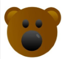
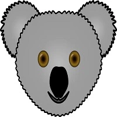

# Matching Bears

Matching Bears is a game website.

This website is designed for the user to play a matching pairs game.

Visit the deployed site here: [Matching Bears](https://gkicks.github.io/chuckles-comedy-club/)

# Contents

- [Matching Bears](#matching-bears)
- [Contents](#contents)
- [User Experience (UX)](#user-experience-ux)
  - [Initial Discussion](#initial-discussion)
    - [Key Information for the Site](#key-information-for-the-site)
  - [User Stories](#user-stories)
    - [Client Goals](#client-goals)
    - [Visitor Goals](#visitor-goals)
- [Design](#design)
  - [Colour Scheme](#colour-scheme)
  - [Typography](#typography)
  - [Imagery](#imagery)
    - [Favicon](#favicon)
    - [Card Images](#card-images)
  - [Wireframes](#wireframes)
    - [Desktop](#desktop)
      - [Start Page](#start-page)
      - [Main Page](#main-page-one)
      - [End Page](#end-page-one)
- [Features](#features)
  - [Existing Features](#existing-features)
    - [The Landing Page](#the-landing-page)
    - [The Main Page](#main-page-two)
    - [The End Page](#end-page-two)
    - [404.html](#404html)
  - [Future Implementations](#future-implementations)
  - [Accessibility](#accessibility)
    - [Wave Validator](#wave-validator)
- [Technologies Used](#technologies-used)
  - [Languages Used](#languages-used)
  - [Frameworks, libraries and programs used](#frameworks-libraries-and-programs-used)
- [Deployment and Local Development](#deployment-and-local-development)
  - [Deployment](#deployment)
  - [Local Development](#local-development)
    - [How to Fork](#how-to-fork)
    - [How to Clone](#how-to-clone)
- [Testing](#testing)
  - [Automated Testing](#automated-testing)
  - [WC3 Validator](#wc3-validator)
  - [JShint Validator](jshint-validator)
  - [Lighthouse](#lighthouse)
    - [Index.html](#indexhtml-1)
      - [Desktop](#desktop-1)
      - [Mobile](#mobile-1)
    - [404.html](#404html-1)
      - [Desktop](#desktop-5)
      - [Mobile](#mobile-5)
  - [Testing User Stories](#testing-user-stories)
    - [Client Goals](#client-goals-1)
    - [Visitor Goals](#visitor-goals-1)
  - [Full Testing](#full-testing)
    - [Start Page](#start-page-two)
    - [Main Page](#main-page-three)
    - [End Page](#end-page-three)
    - [404 Page](#404-page)
  - [Bugs](#bugs)
    - [Resolved Bugs](#resolved-bugs)
    - [Unresolved Bugs](#unresolved-bugs)
- [Credits](#credits)
  - [Code Used](#code-used)
  - [Content](#content)
  - [Media](#media)
  - [Other](#other)
  - [Acknowledgements](#acknowledgements)

[Back to top](#matching-bears)

# User Experience (UX)

## Initial Discussion

Matching Bears is a game playing website. The name Matching Bears is a wordplay on the well known game Matching Pairs. The website is user-friendly and easy to navigate, giving the user a smooth game playing experience

### Key Information for the Site

- How to play instructions
- Game playing area
- Statistics about the user’s game – time taken and number of flips

## User Stories

### Client Goals

- To be responsive on a range of devices
- The game to have different difficulty levels
- Statistics of the game to be displayed
- Have a link to a bears charity

### Visitor Goals

- To be able to easily navigate the website
- Understand the features of the website
- To have an enjoyable game playing experience
- To have the option of sound during the game but to be able to mute this
- To be rewarded when they have won the game
- To be able to play the game at different difficulty levels
- To be able to see their game playing statistics
- To have the opportunity to donate to a charity relating to bears

[Back to top](#matching-bears)

# Design

## Colour Scheme

- Five colours have been used throughout the website - #F6F4F3, #D5BDA9, #BA9D8C, #4C3B32 and #312C2D
- The brown colours were taken from a colour pallette, from the website Coolors, and were chosen as the brown reflects the bear theme

- I wanted the white to be an off white, to make the website easier on the eye, so used the #F6F4F3 colour I used in my last project. This colour compliments the brown pallette chosen

## Typography

- I used Fontjoy, a font pairing website, to help me make font choices. I selected Laila and Playfair Display as I felt that these reflected the game.

- To give the audio button a picture of a speaker I took icons from the website https://fontawesome.com/icons

## Imagery

### Favicon

- • I used a picture of a bear for my favicon. I chose this image as it’s a simple but very classic bear face. This image was taken from pixabay.com

### Card Images

- These images were all found on the website pixabay.com. There are eight different images, for the sixteen game cards, as there is a pair of each

| Card Description |                  Card Image                   |
| :--------------: | :-------------------------------------------: |
|   Yellow Bear    |    |
|   Yellow Bear    |  |
|   Yellow Bear    |    |
|   Yellow Bear    |    |
|   Yellow Bear    |    |
|   Yellow Bear    |     |
|   Yellow Bear    |   |
|   Yellow Bear    |   |

## Wireframes

- Wireframes were created using figma.com
- The website was designed to be the same across desktop and mobile

### Start Page

### Main Page

### End Page

View desktop wireframes on the Figma site: [Desktop](https://www.figma.com/file/4lZLQQasf5A6YJlC5U2uab/Matching-Bears?type=design&node-id=0%3A1&mode=design&t=1eOShOXN4bQ49Ew7-1)

[Back to top](#matching-bears)
